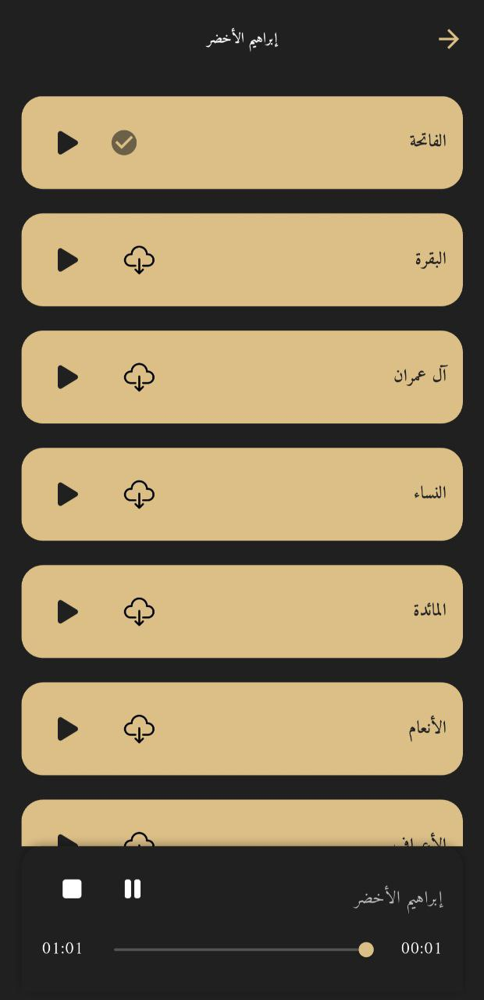
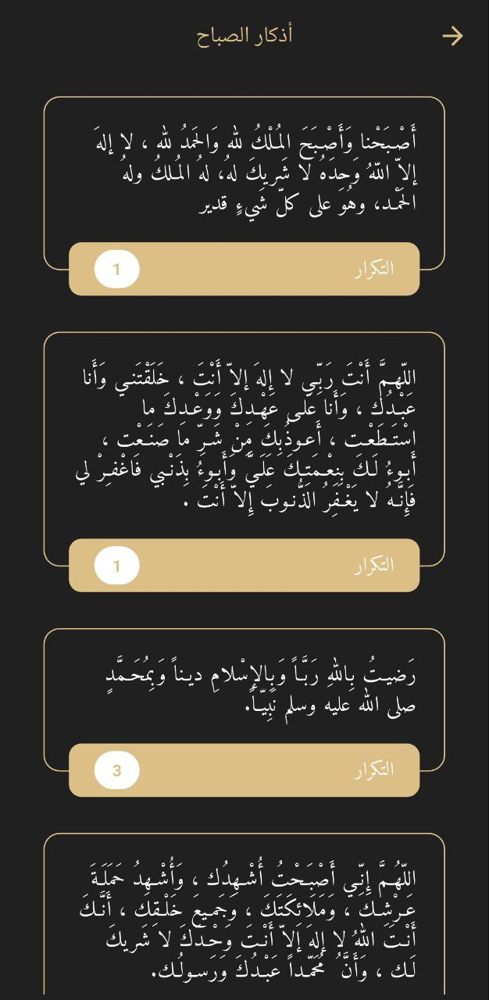

# 📿 Islami App  

*An Islamic app that provides everything a Muslim would need: Qur’an, Hadith, Tasbeeh, Radio, Reciters, Prayer Times, and Azkar — with offline support, streaming, caching, and smart notifications.*  

---

## ✨ Overview  

Islami App is designed to enrich the daily spiritual life of Muslims by combining all essential Islamic resources into one place.  
It offers offline access to Qur’an and Hadith, Tasbeeh counter, online & offline Qur’an recitations, Islamic radios, prayer time calculations with scheduled notifications, and daily Azkar collections.  

Built with **Flutter**, it follows **Clean Architecture** and uses **Riverpod** for state management.  
The app is optimized for performance with **Hive caching**, **file system downloads**, and **background scheduling** to ensure reliability — even without internet access.  

---

## 📸 Screenshots  

> *App screens include:*
## 📸 Screenshots  

| Qur’an | Qur’an Details | Hadith | Hadith Details |
| ------ | -------------- | ------ | --------------- |
|  |  |  |  |

| Sebha (Tasbeeh) | Radio | Reciters | Surah Playback |
| --------------- | ----- | -------- | -------------- |
|  |  |  |  |

| Prayer Times | Azkar List | Azkar Details | Local Notification |
| ------------ | ---------- | ------------- | ------------------ |
|  |  |  |  |

---

## 👥 Target Users  

- Muslims who want quick, reliable access to Qur’an, Hadith, prayer times, and Azkar.  
- Users who value offline-first features with streaming and notification support.  

---

## 📱 Main Features  

- **Qur’an Tab**  
  - Read Qur’an Suwar (offline, stored in local files).  
  - Search and quickly access recently read Surahs (cached in SharedPreferences).  

- **Hadith Tab**  
  - Browse Ahadeeth (offline, from local files).  

- **Tasbeeh (Sebha) Tab**  
  - Count Tasbeeh easily with a digital Sebha (offline).  

- **Radio Tab**  
  - 🎙️ *Radio Sub-tab*: Listen to multiple Islamic radios (streamed online).  
  - 🎧 *Reciters Sub-tab*: Browse reciters (cached in Hive), listen online, or download Surahs as MP3 for offline playback.  
  - Global Mini Player: Control playback (pause/resume/mute) across tabs without leaving the current screen.  

- **Prayer Times Tab**  
  - Detect location via Geolocator.  
  - Calculate prayer times using **Adhan package** and compare with **API times**.  
  - Apply offset correction, cache monthly prayer times in Hive, and reschedule notifications every 48h via WorkManager.  
  - Push **local notifications** 10 minutes before each prayer.  
  - Display **Hijri & Gregorian** date, highlight the next prayer, and show remaining time.  
  - Includes **Azkar** (Morning, Evening, Wake-up) with details & counts.  

---

## 🌟 Unique Selling Points  

- Offline-first support for Qur’an, Hadith, radios, reciters list, and prayer times.  
- Smart caching with Hive (reciters, radios, prayer times).  
- Surah downloads stored in file system for offline recitation playback.  
- Background notification scheduling (flutter_local_notifications + WorkManager).  
- Streamed radios with resilient error handling (no internet feedback).  
- Global mini player for seamless control.  
- Implemented fully in **Clean Architecture** with **Riverpod** state management.  

---

## 🛠️ Tech Stack  

- **Framework:** Flutter  
- **Architecture:** Clean Architecture + Riverpod (state management)  
- **Offline Storage:** Hive, SharedPreferences, file system  
- **Notifications:** flutter_local_notifications, WorkManager  
- **APIs:** Radio & Reciters API, Prayer Times API  
- **Location:** Geolocator + Adhan package for prayer time calculation  

---

## 📦 Dependencies  
| Package                           | Version  | Purpose                                                    |
| --------------------------------- | -------- | ---------------------------------------------------------- |
| **flutter**                       | sdk      | Core Flutter framework                                     |
| **flutter\_localizations**        | sdk      | Internationalization & localization support                |
| **cupertino\_icons**              | ^1.0.8   | iOS-style icons                                            |
| **get**                           | ^4.6.6   | State management, navigation & dependency injection        |
| **firebase\_core**                | ^2.30.0  | Core Firebase initialization                               |
| **firebase\_auth**                | ^4.20.0  | Firebase Authentication (sign-in, sign-up, etc.)           |
| **cloud\_firestore**              | ^4.17.0  | Firebase Cloud Firestore database                          |
| **firebase\_storage**             | ^11.7.0  | Firebase Cloud Storage for files/images                    |
| **firebase\_messaging**           | ^14.9.4  | Push notifications (FCM)                                   |
| **flutter\_bloc**                 | ^8.1.5   | State management with BLoC pattern                         |
| **equatable**                     | ^2.0.5   | Simplifies equality comparisons in Dart classes            |
| **hive**                          | ^2.2.3   | Lightweight & fast local NoSQL database                    |
| **hive\_flutter**                 | ^1.1.0   | Hive Flutter integration                                   |
| **path\_provider**                | ^2.1.5   | Access device paths (documents, temp, etc.)                |
| **intl**                          | ^0.19.0  | Date/number formatting & localization                      |
| **just\_audio**                   | ^0.9.42  | Audio playback                                             |
| **audio\_service**                | ^0.18.13 | Background audio tasks & media controls                    |
| **permission\_handler**           | ^11.3.1  | Runtime permission handling (storage, notifications, etc.) |
| **shared\_preferences**           | ^2.2.3   | Store small amounts of data locally (key-value pairs)      |
| **google\_fonts**                 | ^6.2.1   | Use Google Fonts in the app                                |
| **url\_launcher**                 | ^6.3.1   | Launch URLs, email, phone calls                            |
| **flutter\_local\_notifications** | ^17.0.0  | Local device notifications                                 |
| **lottie**                        | ^3.1.2   | Beautiful animations with Lottie                           |
| **sqflite**                       | ^2.3.3+1 | SQLite database integration                                |
| **workmanager**                   | ^0.5.2   | Background task scheduling                                 |

---

## 🔄 App Flow  

### First Setup (when user installs & opens app)
- Initialize Flutter bindings, timezone DB, Hive, and notifications.  
- Request notification permissions.  
- Load prayer times from Hive or API and schedule notifications.  
- Cache 31 days of prayer times for efficiency.  
- WorkManager task runs every 48h to refresh cache if less than 7 days remain.  

### Reopening the App
- Re-initialize services.  
- Skip past notifications (no duplicates thanks to deterministic IDs).  
- WorkManager ensures notifications are always valid without reopening the app.  

---

## 🚀 Installation  

1. Clone the repo  
2. Run `flutter pub get`  
3. No Firebase setup required (local files + APIs only)  
4. Run with `flutter run`  

---

## 🧪 Testing  

- Unit & widget tests in progress.  
- Focus on notification scheduling, Hive caching, and UI widget behaviors.  

---

## 📍 Why This Project Matters  

This project demonstrates:  
- **Clean Architecture** applied in Flutter.  
- **Riverpod** state management.  
- **Offline-first design** with caching & file storage.  
- **Background tasks** & **local notifications**.  
- **Complex multimedia handling** (streaming, downloading, global playback).  

It’s both a **real-world utility app for Muslims** and a **portfolio showcase of advanced Flutter practices**.  

---

## 📬 Contact  

👤 Developed by Alaa Hesham  
📧 alaa.elkeshky33@gmail.com  
💼 https://www.linkedin.com/in/alaaelkeshky/

